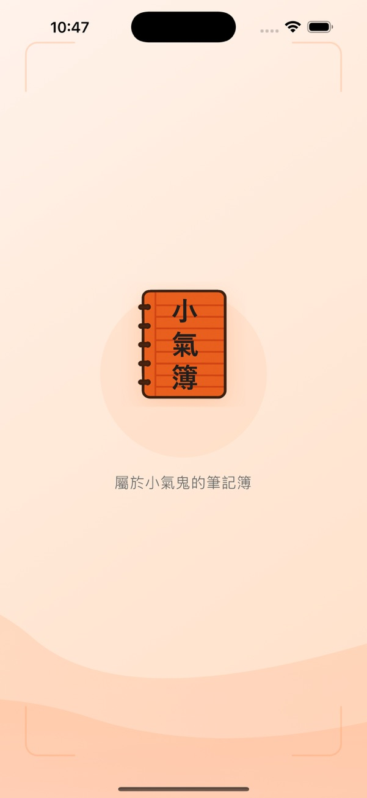
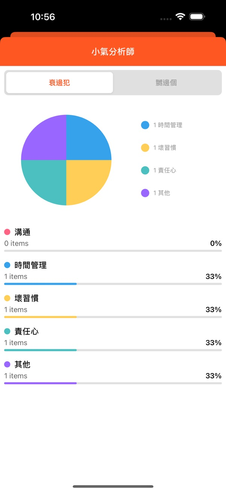
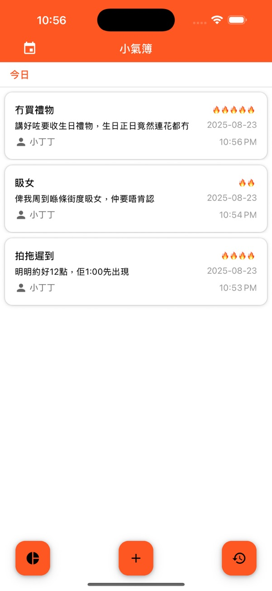
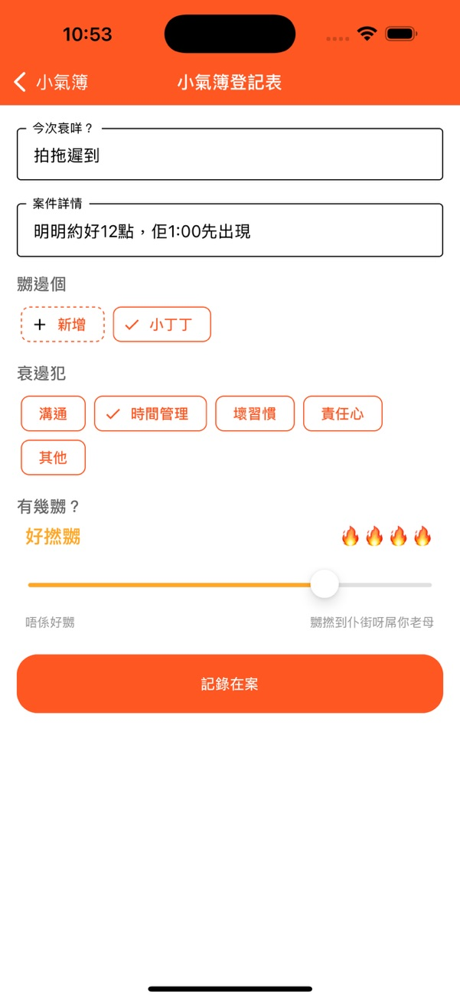

# 📒 小氣簿

屬於小氣鬼的筆記簿

> 😤 有冇試過明明嬲緊人，但又唔記得嬲緊啲乜？

> 😡 又有冇試過好嬲一個人，之後又唔記得？

小氣簿 幫你記錄所有「嬲嬲事件」，等你隨時翻查，永遠唔會算數！

因為 —— 小氣鬼係唔會輕易原諒人㗎！

> [Download iOS](https://apps.apple.com/hk/app/%E5%B0%8F%E6%B0%A3%E7%B0%BF/id6751198051?l=en-GB)

> [Download Android]

## ✨ 功能特色

> 📝 快速記錄你嬲嘅事件

> 🔥 用「火焰等級」表示嬲嬲程度

> 🖼️ 將嬲嬲事件分類，等你容易翻查

> 📊 檢視你嘅嬲嬲紀錄

  
  
  
  

###### ---------------------------------------------------------- 分割線 ----------------------------------------------------------

## Privacy Policy for 小氣簿
Effective Date: August 23, 2025

### Information We Collect
We do not collect, store, or share any personal information or data from users of 小氣簿.

### How We Use Information
Since we do not collect any data, we do not use your information for any purpose.

### Third-Party Services
AngryTracker does not use third-party analytics, advertising, or tracking tools.

### Data Storage and Security
All information you create in the app remains on your device only. If you delete the app, all of your data is permanently deleted with it.

### Changes to This Privacy Policy
If our practices change in the future, we will update this Privacy Policy accordingly.
